# Send message to Teams

[](https://github.com/neonidian/teams-notify-build-status/actions/workflows/test.yml)       [](https://github.com/neonidian/teams-notify-build-status/actions/workflows/codeql-analysis.yml)

JavaScript GitHub action to send message to channel(s) in Microsoft Teams using webhook URL(s)

[](https://buymeacoffee.com/keerthi_subramanian)

* Send a one line message
  


* Additional configuration enables title, status and actor name labels, title background color, buttons that re-direct to run and
  commit URLs
  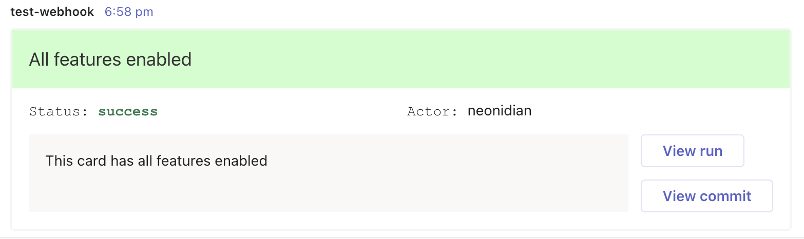

## Usage

1. Add [incoming webhook URL](https://docs.microsoft.com/en-us/microsoftteams/platform/webhooks-and-connectors/how-to/add-incoming-webhook)
for Teams
in [GitHub secrets](https://docs.github.com/en/enterprise-cloud@latest/actions/security-guides/encrypted-secrets)

2. To send a minimal message, add the following in
   your [workflow YAML](https://docs.github.com/en/actions/using-workflows/workflow-syntax-for-github-actions)

E.g.,
```yaml
steps:
  - uses: neonidian/teams-notify-build-status@v3
    with:
      webhookUrl: ${{ secrets.TEAMS_INCOMING_WEBHOOK_URL }}   # Secret name is "TEAMS_INCOMING_WEBHOOK_URL"
      message: Workflow run passed !!
```

3. All features:
   * Send to multiple channels by specifying multiple webhook URLs
   * Display title header
   * Display actor label(GitHub user ID who triggered the workflow) 
   * Display status label
   * Display title background color
   * Enable 'View run' and 'View commit' buttons

E.g.,
```yaml
steps:
  - uses: neonidian/teams-notify-build-status@v3
    with:
      webhookUrl: |                                         # Send to multiple channels in MS Teams
        ${{ secrets.TEAMS_INCOMING_WEBHOOK_URL_1 }}
        ${{ secrets.TEAMS_INCOMING_WEBHOOK_URL_2 }}
      title: Unit Tests                                      # Specify a title header
      titleBackgroundColor: ${{ steps.unitTest.outcome }}    # Specify title background color. 'unitTest' is the ID of a step
      status: ${{ steps.unitTest.outcome }}                  # Specify what should be displayed in the status label
      message: >-
        Unit tests have been run for version ${{ steps.versioning.outputs.semver }}       # 'versioning' is the ID of the steps that creates versioning
    env:                                                     # Enable actor labels and buttons using environment variables
      SHOULD_DISPLAY_ACTOR_LABEL: true
      SHOULD_DISPLAY_VIEW_RUN_BUTTON: true
      SHOULD_DISPLAY_VIEW_COMMIT_BUTTON: true
```

See the actions tab in your GitHub repository for runs of this action! :rocket:

## Inputs and environment variables

### Inputs

| #   | Input ID             | Required | Description                                                                                                                                                                                                                                                                                                                                                                                                                                                             |
|-----|----------------------|----------|-------------------------------------------------------------------------------------------------------------------------------------------------------------------------------------------------------------------------------------------------------------------------------------------------------------------------------------------------------------------------------------------------------------------------------------------------------------------------|
| 1   | webhookUrl           | Yes      | Teams webhook URL(s). If more than 1 webhook URL, use YAML multi-line strings                                                                                                                                                                                                                                                                                                                                                                                           |
| 2   | message              | Yes      | Message to be sent                                                                                                                                                                                                                                                                                                                                                                                                                                                      |
| 3   | title                | No       | Title of the card (displays at the top with a larger text)                                                                                                                                                                                                                                                                                                                                                                                                              |
| 4   | titleBackgroundColor | No       | Background color of the title section. <br/>Allowed values: <br/>'success', 'green', <br/>'failure', 'red',<br/> 'cancelled', 'yellow',<br/>'skipped', 'blue'<br/><br/> success, failure, cancelled, skipped can be used dynamically in the workflow using job or step context.<br/> E.g., `${{ job.status }}` or `${{ steps.<step_id>.outcome }}`<br/> See [GitHub docs](https://docs.github.com/en/actions/learn-github-actions/contexts#steps-context) for more info |
| 5   | status               | No       | [Status](https://docs.github.com/en/actions/learn-github-actions/expressions#status-check-functions) of a step or a job, or a custom text                                                                                                                                                                                                                                                                                                                               |

### Environment variables

| #   | Environment variable              | Allowed values    | Default value | Description                                                                         |
|-----|-----------------------------------|-------------------|---------------|-------------------------------------------------------------------------------------|
| 1   | SHOULD_DISPLAY_VIEW_RUN_BUTTON    | 'true' or 'false' | false         | Clicking on this button redirects to the attempt of the workflow run page in GitHub |
| 2   | SHOULD_DISPLAY_VIEW_COMMIT_BUTTON | 'true' or 'false' | false         | Clicking on this button redirects to SHA commit page in GitHub                      |
| 3   | SHOULD_DISPLAY_ACTOR_LABEL        | 'true' or 'false' | false         | Label to display the username of the workflow initiator                             |

## Examples

1. Send message only when the job is not successful, set status label and display only the 'View Run' button

```yaml
steps:
  - uses: neonidian/teams-notify-build-status@v3
    if: ${{ !success() }}        # For other statuses, see https://docs.github.com/en/actions/learn-github-actions/expressions#status-check-functions
    with:
      webhookUrl: ${{ secrets.TEAMS_INCOMING_WEBHOOK_URL }}
      message: >-
        Failed to publish artifact version ${{ steps.versioning.outputs.semver }}
      status: Failure
    env:
      SHOULD_DISPLAY_VIEW_RUN_BUTTON: true
```

2. Send message only if some jobs have failed, provide status input, title containing link to repository, enable 'View
   run' and 'View commit' buttons, display actor label by setting the environment variables to `true`

```yaml
steps:
  - uses: neonidian/teams-notify-build-status@v3
    needs: [ unitTests, systemTests ]          # IDs of jobs
    if: ${{ job.status == 'failure' }}       # Same as 'failure()'
    with:
      webhookUrl: ${{ secrets.TEAMS_INCOMING_WEBHOOK_URL }}
      title: >-
        [Repository link](${{ github.server_url }}/${{ github.repository }})
      message: Test run failed
      status: ${{ job.status }}
    env:
      SHOULD_DISPLAY_VIEW_RUN_BUTTON: true
      SHOULD_DISPLAY_VIEW_COMMIT_BUTTON: true
      SHOULD_DISPLAY_ACTOR_LABEL: true
```

3. Always send a message even if previous steps have been failed, cancelled or skipped, enable 'View commit' button,
   display title background color based on the current status of the job.

```yaml
steps:
  - uses: neonidian/teams-notify-build-status@v3
    if: always()
    with:
      webhookUrl: |
       ${{ secrets.TEAMS_INCOMING_WEBHOOK_URL_1 }}
       ${{ secrets.TEAMS_INCOMING_WEBHOOK_URL_2 }}
       ${{ secrets.TEAMS_INCOMING_WEBHOOK_URL_3 }}
      message: Workflow has been run
      titleBackgroundColor: ${{ job.status }}
    env:
      SHOULD_DISPLAY_VIEW_COMMIT_BUTTON: true
```

## Tools used

1. [Adaptive cards](https://docs.microsoft.com/en-gb/microsoftteams/platform/task-modules-and-cards/cards/cards-reference#adaptive-card)
   interface of Teams has been used for UI
2. [Actions HTTP client](https://github.com/actions/toolkit/tree/main/packages/http-client) JS library from Actions
   toolkit has been used for HTTP communication
3. GitHub data for constructing workflow run URL, commit URL etc. are fetched via
   the [default GitHub environment variables](https://docs.github.com/en/actions/learn-github-actions/environment-variables#default-environment-variables)

## Features

1. Minimal [payload](dist/) size: Less than 200 KB
2. Uses JavaScript GitHub action. So containers are not needed to run this action

## Sample screenshots (Dark mode enabled in Teams)

1. status = "failure", "View run" and "View commit" buttons enabled
   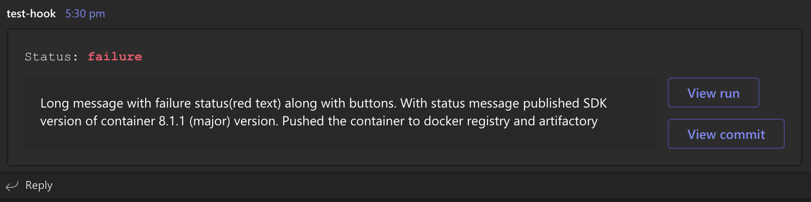


2. status = "skipped", "View run" and "View commit" buttons are not enabled
   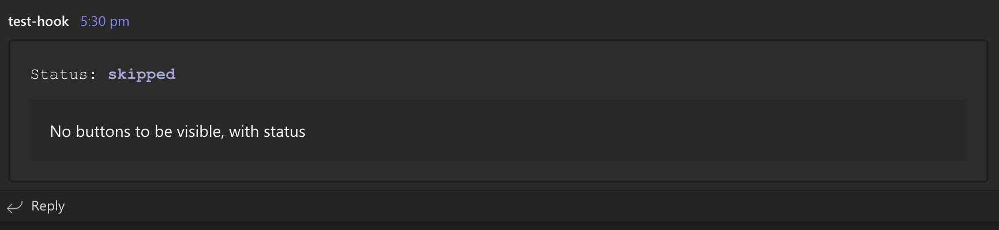


4. No status input provided, title = "Only with title and view run button" with "View Run" button enabled
   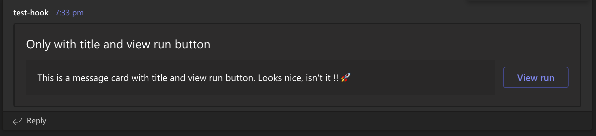


6. status = "skipped", only "View run" is enabled
   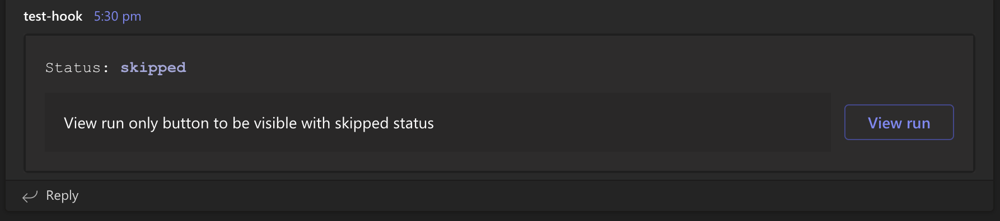


4. status = "cancelled", only "View commit" button enabled
   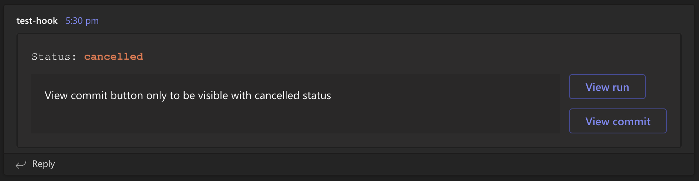


5. Status = "BUILD SUCCESSFUL" which is a custom status not defined in GitHub statuses.
   Font colour is set to default in case of custom status
   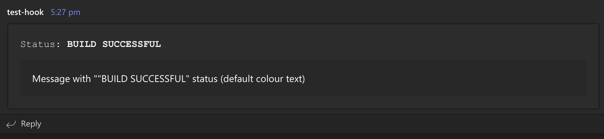


6. titleBackgroundColor = "failure", view run button enabled
   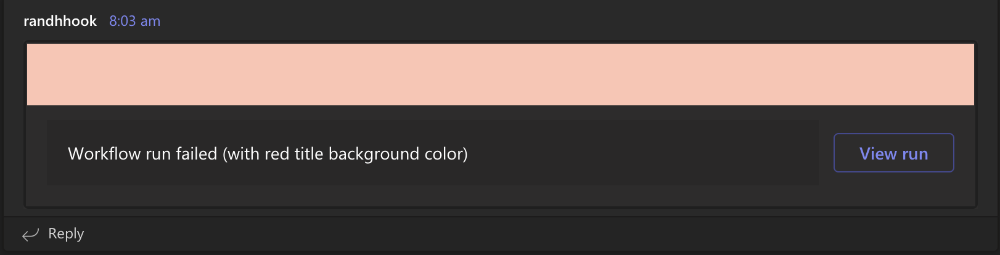


7. title and status inputs provided, titleBackgroundColor = "yellow", view run and view commit buttons enabled
   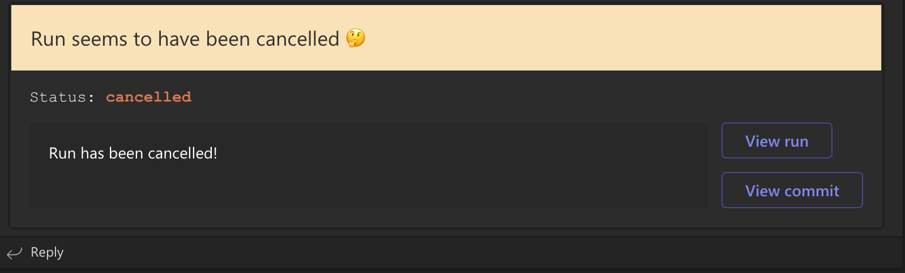


8. Environment variable `SHOULD_DISPLAY_ACTOR_LABEL` set to `true`; set title
   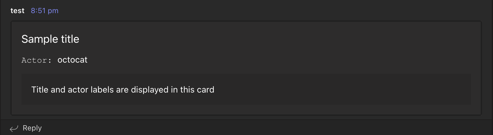


9. Mobile device screenshot (iOS)
   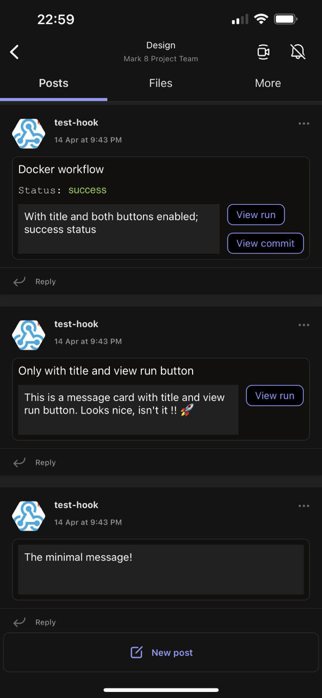
