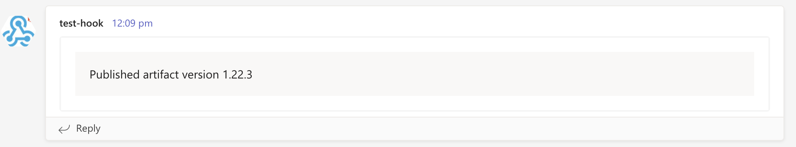
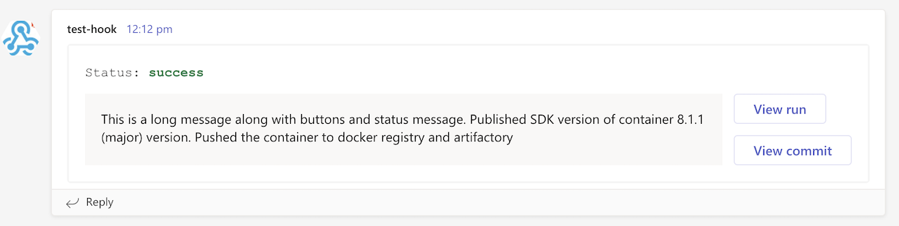

# Send message to Teams

* Send a message to a channel in Teams using webhook



* Additional configuration: Enable status label, buttons that re-direct to run and commit URLs


## Usage

1. Add [incoming webhook URL](https://docs.microsoft.com/en-us/microsoftteams/platform/webhooks-and-connectors/how-to/add-incoming-webhook) from Teams in [GitHub secrets](https://docs.github.com/en/enterprise-cloud@latest/actions/security-guides/encrypted-secrets)

2. To send a message, add the following in your [workflow YAML](https://docs.github.com/en/actions/using-workflows/workflow-syntax-for-github-actions)
```yaml
steps:
  - uses: neonidian/teams-notify-build-status@v2
    with:
      webhookUrl: ${{ secrets.TEAMS_INCOMING_WEBHOOK_URL }}
      message: >-
        Published artifact version ${{ steps.versioning.outputs.semver }}
```

3. Enable status by providing the status input. Enable 'View run' and 'View commit' buttons using environment variables.
```yaml
steps:
  - uses: neonidian/teams-notify-build-status@v2
    if: ${{ always() }}                      # Use this line to always run this action irrespective of previous step failures
    with:
      webhookUrl: ${{ secrets.TEAMS_INCOMING_WEBHOOK_URL }}
      message: >-
        Published artifact version ${{ steps.versioning.outputs.semver }}       # 'versioning' is the ID of the steps that creates versioning
      status: ${{ steps.unitTest.outcome }}  # 'unitTest' is the ID of a step
    env:
      SHOULD_DISPLAY_VIEW_RUN_BUTTON: true
      SHOULD_DISPLAY_VIEW_COMMIT_BUTTON: true
```

See the actions tab in your GitHub repository for runs of this action! :rocket:

## Inputs and environment variables

| #   | Input ID | Required | Description                                      |
|-----|----------|----------|--------------------------------------------------|
| 1   |webhookUrl | Yes      | Incoming webhook URL from MS Teams               |
| 2   |message    | Yes      | Message to be sent                               |
| 3   |status     | No       | Status of a step or a job or a custom text       |


| #   | Environment variable              | Default value | Description                                                        |
|-----|-----------------------------------|---------------|--------------------------------------------------------------------|
| 1   | SHOULD_DISPLAY_VIEW_RUN_BUTTON    | false         | Clicking on this button redirects to the action run page in GitHub |
| 2   | SHOULD_DISPLAY_VIEW_COMMIT_BUTTON | false         | Clicking on this button redirects to SHA commit page in GitHub     |

## Examples
1. Send message only when the job is failing and display only 'View Run' button
```yaml
steps:
  - uses: neonidian/teams-notify-build-status@v2
    if: ${{ failure() }}        # For other statuses, see https://docs.github.com/en/actions/learn-github-actions/expressions#status-check-functions
    with:
      webhookUrl: ${{ secrets.TEAMS_INCOMING_WEBHOOK_URL }}
      message: >-
        Failed to publish artifact version ${{ steps.versioning.outputs.semver }}
      status: Failure
    env:
      SHOULD_DISPLAY_VIEW_RUN_BUTTON: true
```

2. Send message only if some jobs have failed, enable 'View run' and 'View commit' buttons
```yaml
steps:
    - uses: neonidian/teams-notify-build-status@v2
      needs: [unitTests, systemTests]          # IDs of jobs
      if: ${{ job.status == 'failure' }}       # Same as 'failure()'
      with:
        webhookUrl: ${{ secrets.TEAMS_INCOMING_WEBHOOK_URL }}
        message: Test run failed
        status: ${{ job.status }}
      env:
        SHOULD_DISPLAY_VIEW_RUN_BUTTON: true
        SHOULD_DISPLAY_VIEW_COMMIT_BUTTON: true
```
