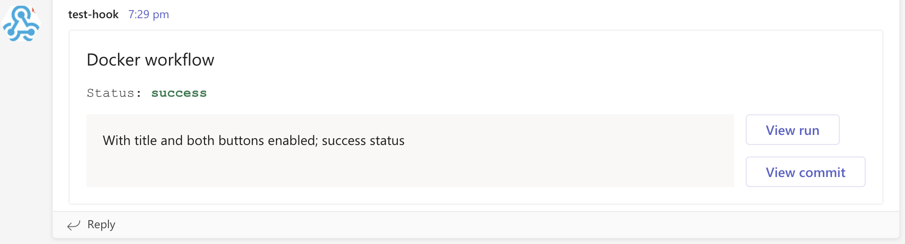

# Send message to Teams
[](https://github.com/neonidian/teams-notify-build-status/actions/workflows/test.yml)       [](https://github.com/neonidian/teams-notify-build-status/actions/workflows/codeql-analysis.yml)

* Send a message to a channel in Teams using webhook
  


* Additional configuration enables title and status labels, buttons that re-direct to run and commit URLs
  

## Usage

1. Add [incoming webhook URL](https://docs.microsoft.com/en-us/microsoftteams/platform/webhooks-and-connectors/how-to/add-incoming-webhook)
for Teams
in [GitHub secrets](https://docs.github.com/en/enterprise-cloud@latest/actions/security-guides/encrypted-secrets)

2. To send a message, add the following in
   your [workflow YAML](https://docs.github.com/en/actions/using-workflows/workflow-syntax-for-github-actions)

```yaml
steps:
  - uses: neonidian/teams-notify-build-status@v2
    with:
      webhookUrl: ${{ secrets.TEAMS_INCOMING_WEBHOOK_URL }}
      message: >-
        Published artifact version ${{ steps.versioning.outputs.semver }}
```

3. Enable title and status labels by providing the title and status input. 
Enable 'View run' and 'View commit' buttons using environment variables.

```yaml
steps:
  - uses: neonidian/teams-notify-build-status@v2
    if: ${{ always() }}                      # Use this line to always run this action irrespective of previous step failures
    with:
      webhookUrl: ${{ secrets.TEAMS_INCOMING_WEBHOOK_URL }}
      title: Artifact build and publish
      message: >-
        Published artifact version ${{ steps.versioning.outputs.semver }}       # 'versioning' is the ID of the steps that creates versioning
      status: ${{ steps.unitTest.outcome }}  # 'unitTest' is the ID of a step
    env:
      SHOULD_DISPLAY_VIEW_RUN_BUTTON: true
      SHOULD_DISPLAY_VIEW_COMMIT_BUTTON: true
```

See the actions tab in your GitHub repository for runs of this action! :rocket:

## Inputs and environment variables

| #   | Input ID   | Required | Description                                                                                                                               |
|-----|------------|----------|-------------------------------------------------------------------------------------------------------------------------------------------|
| 1   | webhookUrl | Yes      | Incoming webhook URL from MS Teams                                                                                                        |
| 2   | message    | Yes      | Message to be sent                                                                                                                        |
| 3   | title      | No       | Title of the card (displays at the top with a larger text)                                                                                |
| 4   | status     | No       | [Status](https://docs.github.com/en/actions/learn-github-actions/expressions#status-check-functions) of a step or a job, or a custom text |

| #   | Environment variable              | Allowed values    | Default value | Description                                                        |
|-----|-----------------------------------|-------------------|---------------|--------------------------------------------------------------------|
| 1   | SHOULD_DISPLAY_VIEW_RUN_BUTTON    | 'true' or 'false' | false         | Clicking on this button redirects to the action run page in GitHub |
| 2   | SHOULD_DISPLAY_VIEW_COMMIT_BUTTON | 'true' or 'false' | false         | Clicking on this button redirects to SHA commit page in GitHub     |

## Examples

1. Send message only when the job is failing and display only 'View Run' button

```yaml
steps:
  - uses: neonidian/teams-notify-build-status@v2
    if: ${{ failure() }}        # For other statuses, see https://docs.github.com/en/actions/learn-github-actions/expressions#status-check-functions
    with:
      webhookUrl: ${{ secrets.TEAMS_INCOMING_WEBHOOK_URL }}
      message: >-
        Failed to publish artifact version ${{ steps.versioning.outputs.semver }}
      status: Failure
    env:
      SHOULD_DISPLAY_VIEW_RUN_BUTTON: true
```

2. Send message only if some jobs have failed, enable 'View run' and 'View commit' buttons

```yaml
steps:
  - uses: neonidian/teams-notify-build-status@v2
    needs: [ unitTests, systemTests ]          # IDs of jobs
    if: ${{ job.status == 'failure' }}       # Same as 'failure()'
    with:
      webhookUrl: ${{ secrets.TEAMS_INCOMING_WEBHOOK_URL }}
      message: Test run failed
      status: ${{ job.status }}
    env:
      SHOULD_DISPLAY_VIEW_RUN_BUTTON: true
      SHOULD_DISPLAY_VIEW_COMMIT_BUTTON: true
```

## Tools used

1. [Adaptive cards](https://adaptivecards.io/) interface of Teams has been used for UI
2. [Axios](https://axios-http.com/) JS library has been used for HTTP communication

## Sample screenshots (Dark mode enabled in Teams)

1. status = "failure", "View run" and "View commit" buttons enabled


2. status = "skipped", "View run" and "View commit" buttons are not enabled


4. No status input provided, title = "Only with title and view run button" with "View Run" button enabled


6. status = "skipped", only "View run" is enabled


4. status = "cancelled", only "View commit" button enabled


5. Status = "BUILD SUCCESSFUL" which is a custom status not defined in GitHub statuses. 
Font colour is set to default in case of custom status

